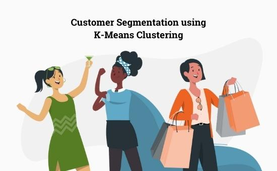

<!-- Section -->
<section>
	<header class="major">
		<h3>Projects</h3>
	</header>
	

		<article>
			
			<h3><a href="{{ '/posts/persona.html' | absolute_url }}">Customer Segmentation</a></h3>
			
As part of the requirements to complete the For The Women Foundation Data Science Program, real-world data from a sponsor company was given to our team. Data analysis and modelling was done through Excel, Python, and Tableau.

			<ul class="actions">
				<li><a href="{{ '/posts/persona.html' | absolute_url }}" class="button">More</a></li>
			</ul>
		</article>
		<article>
			
			<h3><a href="{{ '/posts/shs.html' | absolute_url }}">SHS Enrollment Analysis</a></h3>
			
The K to 12 program was implemented in the Philippines in recent years. Using Historical Data of Senior High School Enrollment from 2016 to 2021 from the Department of Education, exploratory data analysis was done using Excel and Power BI.

			<ul class="actions">
				<li><a href="{{ '/posts/shs.html' | absolute_url }}" class="button">More</a></li>
			</ul>
		</article>
	

</section>
